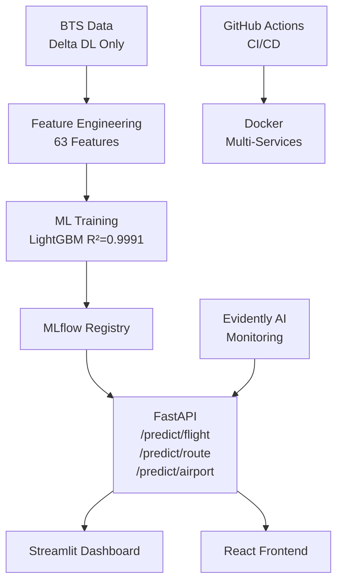

# ✈️ Delta Airlines — Flight Passenger Prediction Platform

> ML-Powered Load Factor Forecasting | Standard Airbus/Amadeus MLOps 2026


## 🎯 Problem Statement
Delta Air Lines transporte ~200M passagers/an.
Optimiser le Load Factor est l'enjeu #1 de rentabilité :
**+1% LF = ~$250M de revenus additionnels annuels.**

## 🏆 Model Performance
| Model | MAE | R² | MAPE |
|-------|-----|----|------|
| 🥇 LightGBM | 0.363% | 0.9991 | 0.55% |
| 🥈 XGBoost | 0.414% | 0.9989 | 0.62% |
| 🥉 GradientBoosting | 0.504% | 0.9983 | 0.77% |
| RandomForest | 2.774% | 0.9561 | 4.02% |

## 🚀 Stack
| Tech | Usage |
|------|-------|
| Python 3.11 + uv | Environment |
| LightGBM / XGBoost | ML Models |
| MLflow | Experiment Tracking |
| FastAPI | REST API |
| Streamlit | POC Dashboard |
| PostgreSQL | Metadata Store |
| Docker Compose | Orchestration |
| GitHub Actions | CI/CD |
| Evidently AI | ML Monitoring |

## 🛫 Services
| Service | URL |
|---------|-----|
| FastAPI Swagger | http://localhost:8000/docs |
| Streamlit Dashboard | http://localhost:8501 |
| MLflow UI | http://localhost:5000 |

## ⚡ Quick Start
```bash
# Clone
git clone https://github.com/TON_USERNAME/flight-passenger-prediction
cd flight-passenger-prediction

# Setup
pip install uv
uv venv && .venv/Scripts/activate
uv add -r requirements.txt

# Generate data + train
python data/download_bts.py
python poc/feature_engineering.py
python poc/train_models.py

# Launch services
docker-compose up -d

# Run tests
pytest tests/ -v
```

## 📊 Architecture


## ✅ Tests
```
53/53 tests passed
```